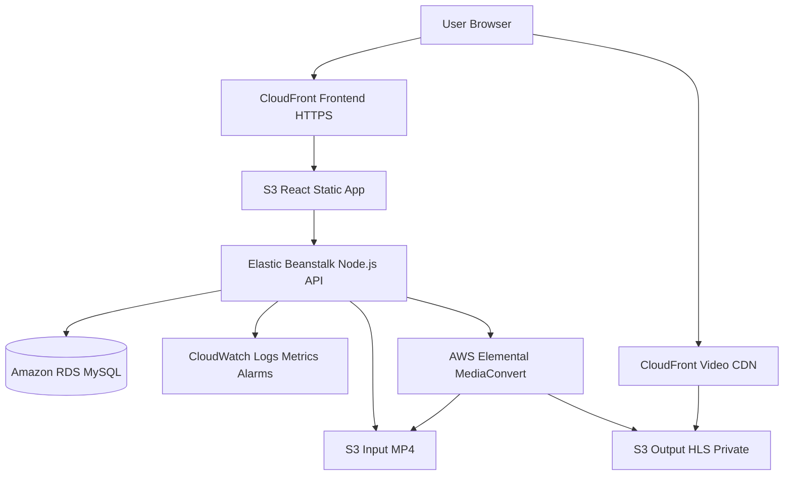
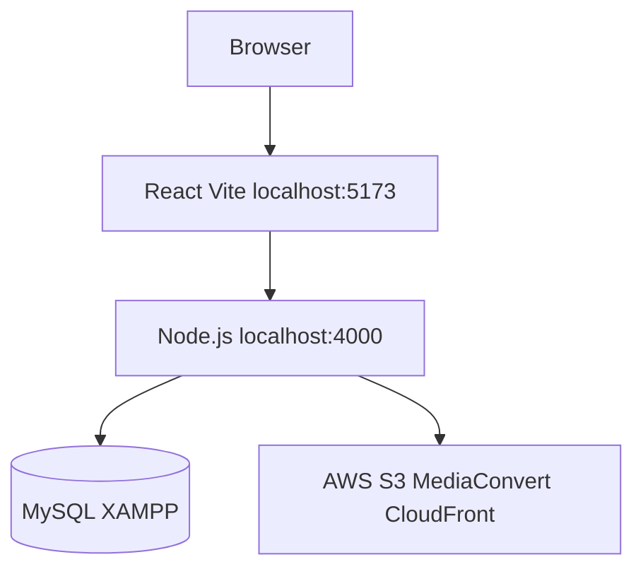
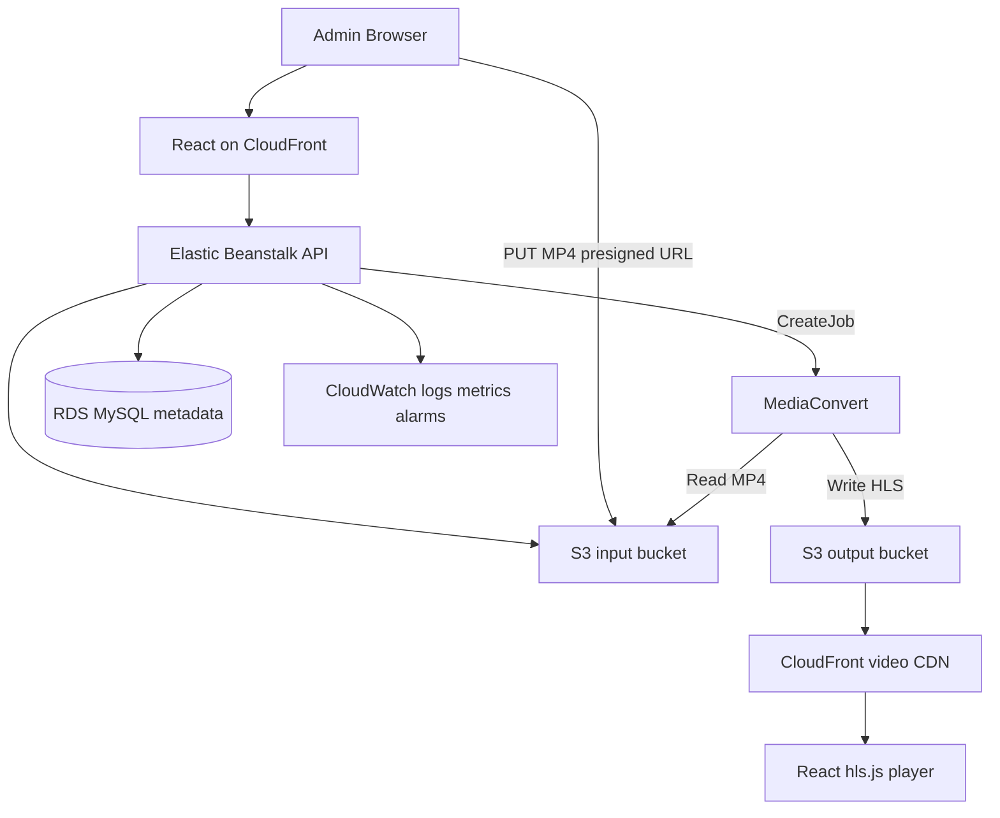
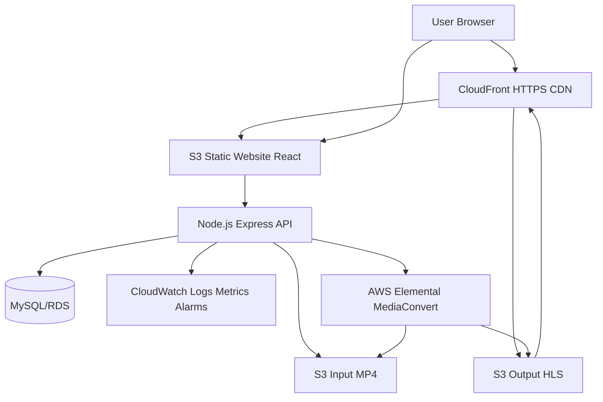
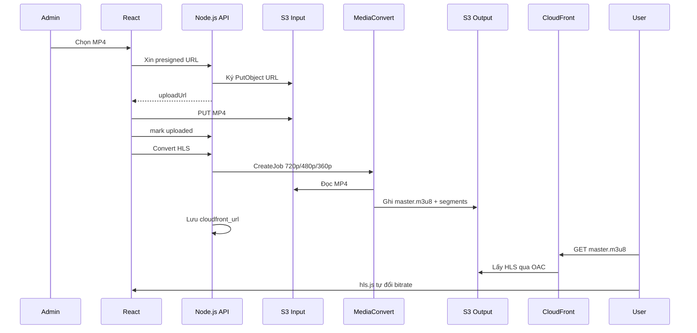

# Sơ Đồ Kiến Trúc

## Website xem phim full AWS

```mermaid
flowchart TD
  U[User Browser] --> FECF[CloudFront Frontend HTTPS]
  FECF --> FE[S3 React Static App]
  FE --> EB[Elastic Beanstalk Node.js API]
  EB --> RDS[(Amazon RDS MySQL)]
  EB --> CW[CloudWatch Logs Metrics Alarms]
  EB --> S3IN[S3 Input MP4]
  EB --> MC[AWS Elemental MediaConvert]
  MC --> S3IN
  MC --> S3OUT[S3 Output HLS Private]
  U --> VCF[CloudFront Video CDN]
  VCF --> S3OUT
```

## Bản local dev

```mermaid
flowchart TD
  U[Browser] --> FELOCAL[React Vite localhost:5173]
  FELOCAL --> APILOCAL[Node.js localhost:4000]
  APILOCAL --> MYSQL[(MySQL XAMPP)]
  APILOCAL --> AWS[AWS S3 MediaConvert CloudFront]
```

## Luồng adaptive bitrate full AWS

```mermaid
flowchart TD
  Admin[Admin Browser] --> FE[React on CloudFront]
  FE --> API[Elastic Beanstalk API]
  API --> S3IN[S3 input bucket]
  Admin -->|PUT MP4 presigned URL| S3IN
  API -->|CreateJob| MC[MediaConvert]
  MC -->|Read MP4| S3IN
  MC -->|Write HLS| S3OUT[S3 output bucket]
  S3OUT --> VCF[CloudFront video CDN]
  VCF --> Player[React hls.js player]
  API --> RDS[(RDS MySQL metadata)]
  API --> CloudWatch[CloudWatch logs metrics alarms]
```

## Luồng ban đầu đã hỗ trợ local

```mermaid
flowchart TD
  U[User Browser] --> CF[CloudFront HTTPS CDN]
  CF --> FE[S3 Static Website React]
  U --> FE
  FE --> API[Node.js Express API]
  API --> DB[(MySQL/RDS)]
  API --> CW[CloudWatch Logs Metrics Alarms]
  CF --> OUT[S3 Output HLS]
  API --> S3IN[S3 Input MP4]
  API --> MC[AWS Elemental MediaConvert]
  MC --> S3IN
  MC --> OUT
  OUT --> CF
```

## Luồng adaptive bitrate

```mermaid
sequenceDiagram
  participant Admin
  participant React
  participant API as Node.js API
  participant S3In as S3 Input
  participant MC as MediaConvert
  participant S3Out as S3 Output
  participant CF as CloudFront
  participant User

  Admin->>React: Chọn MP4
  React->>API: Xin presigned URL
  API->>S3In: Ký PutObject URL
  API-->>React: uploadUrl
  React->>S3In: PUT MP4
  React->>API: mark uploaded
  React->>API: Convert HLS
  API->>MC: CreateJob 720p/480p/360p
  MC->>S3In: Đọc MP4
  MC->>S3Out: Ghi master.m3u8 + segments
  API->>API: Lưu cloudfront_url
  User->>CF: GET master.m3u8
  CF->>S3Out: Lấy HLS qua OAC
  User->>React: hls.js tự đổi bitrate
```
